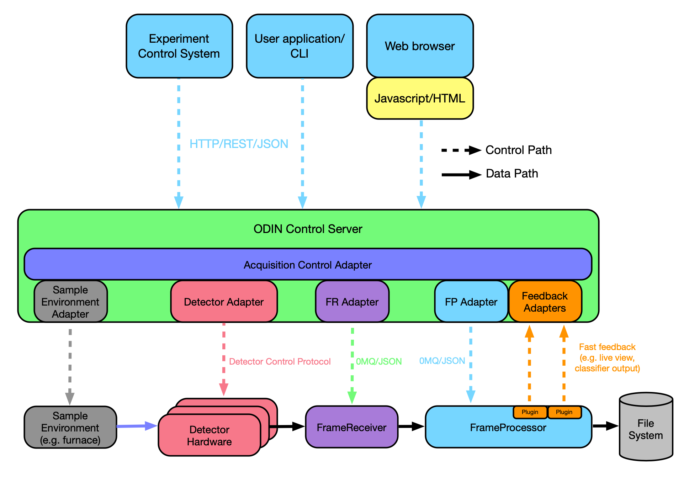

# Odin Detector Software Framework

The Odin Detector software framework provides a python-based framework for the control plane of detector systems and a set of high performance data acquisition applications that integrate seamlessly into the control framework.

Figure 1. Odin detector architecture

The Odin Detector framework comprises two parts; Odin Control, the central control application, and Odin Data, a data acquisition stack, both of which can be used independently of each other as well as in conjunction.  These parts are maintained as two software repositories.  Documentation for each of the Odin repositories can be accessed here:

- [Odin Control](http://odin-detector.github.io/odin-control/)
- [Odin Detector](https://odin-detector.github.io/odin-data/)

## Rationale

Devices that consist of multiple individual parts can lead to complications in the higher control layer, whose job is to try and get them to operate together in unity. 

The Odin software framework is designed specifically for this modular architecture by mirroring the structure within its internal processes. For example, the data acquisition modules have the perspective of being one of many nodes built into the core of their logic. This makes it straightforward to operate multiple applications on the same hardware server or across muliple hardware servers working together to perform a single acquisition, all managed by a single point of control.

Given the often collaborative nature of detector development, the Odin software framework has been designed to be generic, providing simple integration with any higher level control system.
