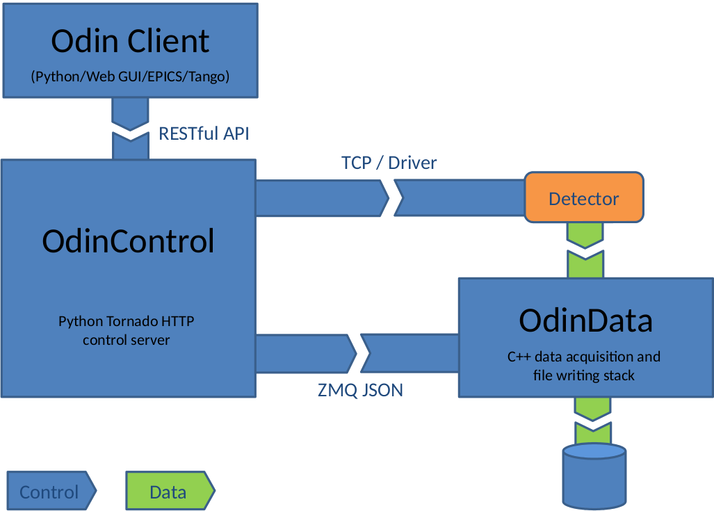

Introduction
============

Odin Detector
-------------

An Odin Detector deployment at the most basic level consists of the following software:

* A control server.  This server is built ontop of the Tornado Python webserver.
* A set of Python adapters.  Each adapter contains a functional block of code that can be controlled and queried through standard HTTP requests.
* (Optional) A set of FrameReceiver C++ applications listening for data arriving from the detector.
* (Optional) A set of FrameProcessor C++ applications processing data coming out of the FrameReceivers.

FrameReceivers and FrameProcessors are always deployed as a pair and each pair must be located 
together on physical hardware.  This is explained in detail in the Odin Data section.  Any number of 
adapters can be loaded into a control server, and each adapter can operate independently or communicate
with the other adapters present in the server.  Details of the control server can be found in the Odin
Control section below.

The figure below shows a typical Odin Detector setup.  The blocks make no assumptions for 
the location of hardware, quantity of computers, or the type of detector.

   Figure 1. Odin Detector block diagram.

All of the communication between the parts of an Odin Detector deployment is carried out using
either HTTP request/responses or through ZeroMQ sockets.  This has the advantage that parts of
the system can be distributed across multiple physical hardware components if more processing 
power is required, and this is especially important for the Odin Data applications which may be
dealing with a high throughput of data arriving from a detector.

Odin Control
------------

Odin Data
---------

OdinData gathers incoming frames from a data stream and writes them to disk as quickly as 
possible. It has a modular architecture making it simple to add functionality and extend its 
use for new detectors. The function of the software itself is relatively simple, allowing a 
higher-level supervisory control process to do the complex logic defined by each experimental 
situation and exchanging simple configuration messages to perform specific operations. This 
makes it easy for the control system to operate separate systems cooperatively.

OdinData consists of two separate processes. These are the FrameReceiver (FR) and the 
FrameProcessor (FP). The FR is able to collect data packets on various input channel
types, for example UDP and ZeroMQ [6], construct data frames and add some useful meta data 
to the packet header before passing it on to the FP through a shared memory interface. The 
FP can then grab the frame, construct data chunks in the correct format and write them to 
disk. The two separate processes communicate via inter-process communication (IPC) messages 
over two ZMQ channels. When the FR places a frame into shared memory, it sends a message 
over the ready channel, the FP consumes the frame and once it is finished passes a message 
over the release channel allowing the FR to re-use the frame memory. The use and re-use of 
shared memory reduces the copying of large data blobs and increases data throughput. This 
logic is shown visually in Fig. 4.

The overall concept is to allow a scalable, parallel data
acquisition stack writing data to a individual files in a shared
network location. This allows fine tuning of the process
nodes for a given detector system, based on the image size
and frame rate, to make sure the beamline has the capacity to
carry out its experiments and minimise the data acquisition
bottleneck.

Plugins
OdinData is extensible by the implementation of plugins.
The Excalibur detector has a module with two plugins built
against the OdinData library. One for the FR and one for
the FP. These provide the implementation of a decoder of
the raw frame data as well as the processing required to
define the data structure written to disk. As an example,
the Excalibur plugins implement some algorithms [4] to
perform transforms to rotate chunks of the input data, due
to the physical orientation of the chips on the detector. The
implementation of any other detector would simply require
the two plugins to be replaced with equivalents, to process
the output data stream; the surrounding logic would remain
exactly the same.

API
OdinData provides a python library with simple methods
for initialising, configuring and retrieving status from the
FP and FR processes at runtime. These can be integrated
with a wider control system, but can also be used directly in
a simple python script or interactively from a python shell.
This is how OdinData integrates with OdinControl; there is
no special access granted, the interface is generic allowing
it to be integrated with other control systems.
HDF5 Features
To take advantage of the high data rates of modern de-
tectors, OdinData seeks to write data to disk quickly with
minimal processing overhead. To achieve this, the built-in
FileWriterPlugin employs some of the latest features of the
HDF5 library.
The Virtual Dataset (VDS) [7] enables the file writing to
be delegated to a number of independent, parallel processes,
because the data can all be presented as a single file at the
end of an acquisition using VDS to link to the raw datasets.
Secondly, with Single Writer Multiple Reader (SWMR) [7]
functionality, datasets are readable throughout the acquisi-
tion and live processing can be carried out while frames are
still being captured, greatly reducing the overall time to pro-
duce useful data. Though the real benefit comes when these
two features are combined. A VDS can be created anytime
before, during or after and acquisition, independent of when
the raw datasets and created. Then, as soon as the parallel
writers begin writing to each raw file, the data appears in
the VDS as if the processes were all writing to the same file
and can be accessed by data analysis processes in exactly
the same way.
A more straightforward improvement in the form of a data
throughput increase is found by the use of Direct Chunk
Write [7]. With a little extra effort in the formatting of the
data chunk, this allows the writer to skip the processing
pipeline that comes with the standard write method and
write a chunk straight to disk as provided. This reduces the
processing required and limits data copying. For the Eiger
use case specifically, great use is made of the Direct Chunk
Write to allow writing of pre-compressed images from the
detector to file. Due to the considerable data rate of the
detector, compression is used to reduce network and file
writing load by around a factor of four, depending on the
sensor exposure. Reader applications can use Dynamically
Loaded Filters [7] to read the datasets.
